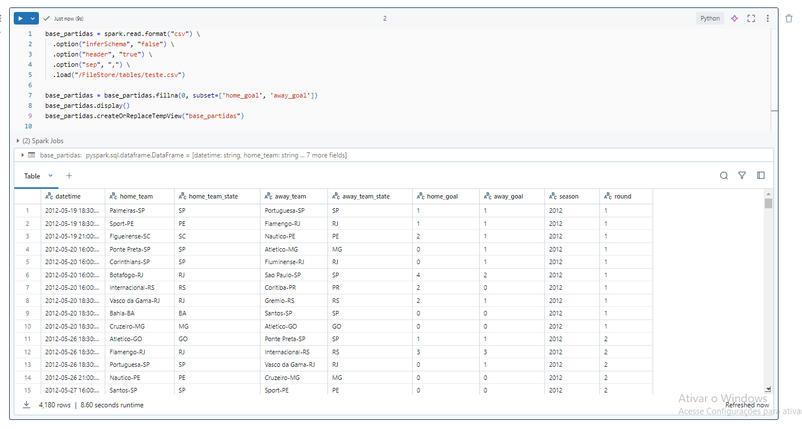
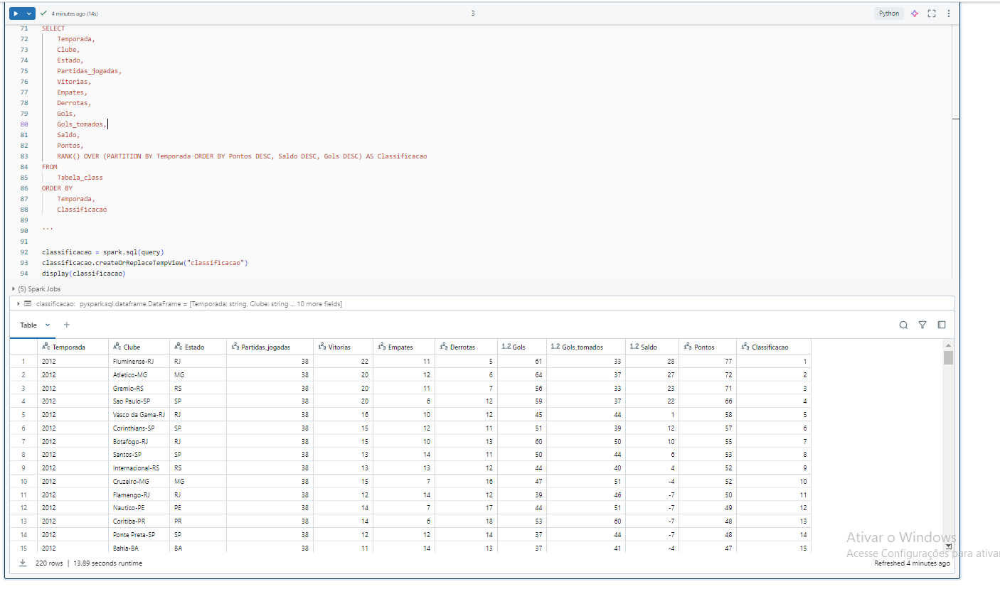
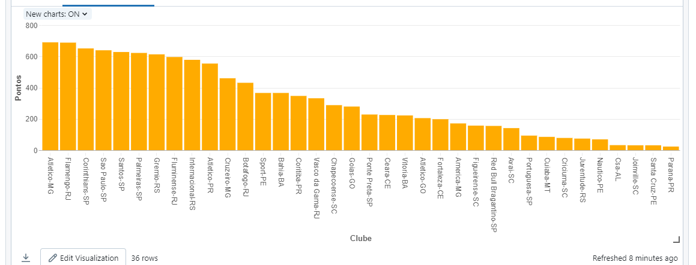
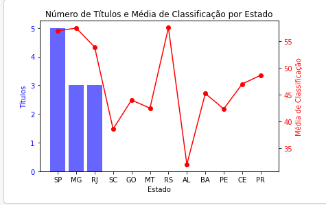
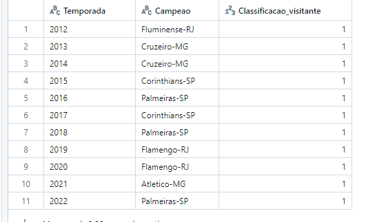
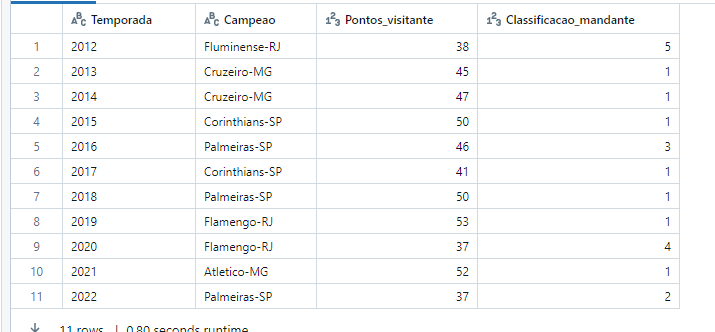
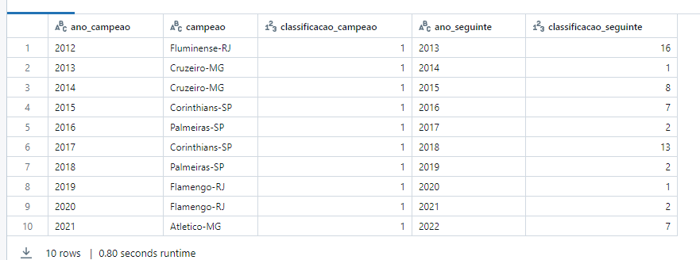
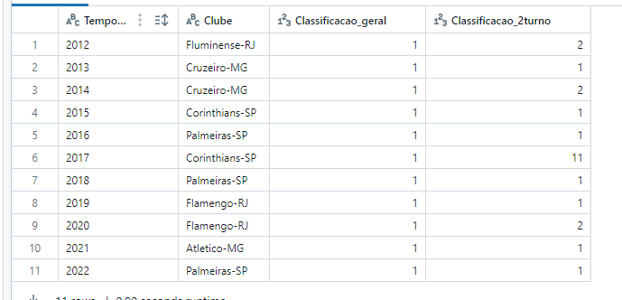

# Brasileirão Analytics
)

# 1.0 Objetivo
O objetivo deste trabalho é analisar fatores e variáveis que podem influenciar o desempenho das equipes no Brasileirão. Através de análises, diversas perguntas pertinentes ao desempenho dos clubes serão melhor entendidas:

Desempenho Fora de Casa: O desempenho do clube jogando fora de casa pode ser um determinante para a conquista do campeonato?

Desempenho em Casa: O desempenho dentro de casa tem um impacto significativo na conquista do campeonato?

Desempenho de Campeões Anteriores: Os campeões de temporadas anteriores conseguem manter o alto nível de desempenho no ano seguinte, ou geralmente apresentam uma queda significativa?

Impacto do Fator Estadual: O desempenho das equipes é influenciado pelo estado de origem? Times de determinados estados têm vantagens ou desvantagens específicas?

Este estudo pretende oferecer uma visão abrangente e detalhada sobre como esses fatores interagem e influenciam os resultados das equipes no Brasileirão, utilizando dados estatísticos para apoiar as conclusões

# 2.0 Coleta

A coleta foi feita no site da kaggle: https://www.kaggle.com/datasets/ricardomattos05/jogos-do-campeonato-brasileiro

# 3.0 Modelagem
|Atributos | Descrição |
|----------|-----------|
|datetime | Data e horário do jogo: 2012-06-06 20:30:00 - 2022-11-13 16:00:00 |
|home_team|	Clube mandante |
|home_team_state | Estado do Clube |
|away_team | Clube visitante |
|away_team_state | Estado |
|home_goal | Quantos Gols o mandante fez: 0-6 gols |
|away_goal|	Quantos Gols o visitante fez: 0-6 gols |
|season | Temporada 2012-2022 |
|round| Rodada 1-38 |

Como é apenas 1 arquivo, então não houve necessidade de uma descrição complexa da modelagem.

# 4.0 Modelagem
O upload feito diretamente no Databricks através do DBFS.

Tabela raw carregada no DataBricks usando pyspark e usando Valores NA que estão nas colunas de gols como 0 para que o resultado final não seja influenciado. Provavelmente a tabela foi criada antes do fim do Brasileiro 2022.

Foi necessário a criação de uma tabela temporária no DataBricks mostrando a classificação final do campeonato por ano para que algumas análises fossem possíveis.

# 5.0 Análises

 5.1 Quais Clubes são mais consistentes nesse recorte do Brasileirão? Quais clubes participaram de todas as edições?

Pela tabela mostrada, vemos que o Atlético Mineiro se mostrou o clube mais consistente tanto na pontuação geral quanto na média de pontuação. 
Além disso, juntamente com poucos clubes, foi o clube que mais participou nesse recorte do Dataset.

5.2 Quais estados desempenham melhor no campeonato?

Vemos uma predominância maior dos estados do Sudeste nas conquistas dos Brasileirões, com destaque para o Estado de São Paulo com mais títulos e para MG com a maior média de pontos dentro dos Estados. 
Estados sem títulos apresentam uma maior variabilidade nas médias de classificação, com alguns estados próximos às médias dos estados campeões (como RS e PR) e outros com médias significativamente mais baixas (como AL e SC).

5.3 Os times que mais venceram fora de casa costuma ser campeões?

Por essa análise observamos que SIM, nessa amostra de brasileirões, o time que tem a melhor campanha como visitante também é campeão. 100% dos campeões analisados tiveram a melhor campanha como visitantes. 
Isso sugere que o desempenho fora de casa é um fator crucial para a conquista do título.

5.4 Os times que mais venceram dentro de casa costuma ser campeões?

Por essa análise observamos que grande parte dos times que tem a melhor campanha como mandante também são campeões. 
No entanto, não se mostrou uma variável tão importante como a campanha como visitante pois, cerca de 63% dos campeões nesse período tiveram a melhor campanha como mandante enquanto que no caso dos visitantes, chega nos 100%.

5.5 Como os campeões desempenham no ano seguinte?

Vemos que apenas 20% das vezes, que foi possível avaliar o desempenho dos campeões no ano seguinte,  o campeão repetiu o feito no ano seguinte. 
Em média, os times campeões do Brasileirão tendem a ter uma queda no desempenho no ano seguinte, caindo cerca de 5 posições na tabela.Há exceções notáveis, como o Cruzeiro em 2014 e o Flamengo em 2020, que mantiveram uma alta classificação (1º e 2º lugares, respectivamente). 
Alguns campeões, como o Fluminense em 2013 (16º lugar) e o Corinthians em 2018 (13º lugar), tiveram uma queda mais acentuada no desempenho no ano seguinte.Embora alguns campeões consigam manter um alto desempenho, em média, há uma tendência de queda significativa na classificação no ano seguinte ao título

5.6 Desempenho no 2 turno é determinante para a conquista de título?

Muitos campeões (como o Cruzeiro em 2013, Corinthians em 2015, Palmeiras em 2016, 2018 e 2022, Flamengo em 2019 e 2021, e Atlético-MG em 2021) mantiveram uma alta posição tanto na classificação geral quanto na classificação do segundo turno.Algumas exceções incluem o Fluminense em 2012 e o Flamengo em 2020, que não terminaram o segundo turno como líderes, mas ainda assim conquistaram o título geral. 
A maior exceção é o Corinthians em 2017, que teve um desempenho significativamente pior no segundo turno (11º lugar) mas ainda conquistou o título. Um bom desempenho no segundo turno geralmente contribui significativamente para a conquista do título, mas não é um fator absolutamente determinante. 
Existem exceções onde o clube não foi o melhor no segundo turno, mas ainda assim conseguiu ganhar o campeonato. 

